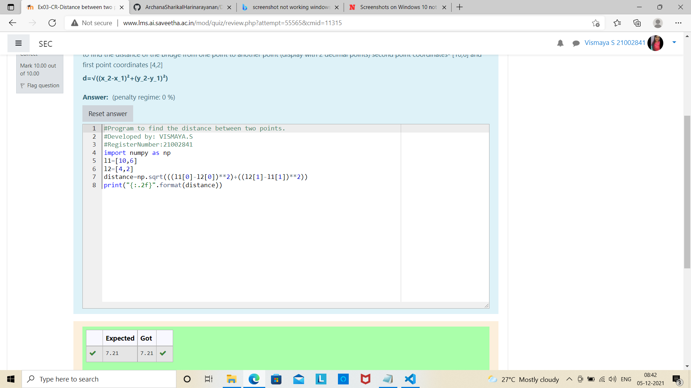

# DISTANCE-BETWEEN-TWO-POINTS

## AIM:
To write a python program to find the distance two 2 points
## ALGORITHM:
### Step 1: get two values from the user
### Step 2: assign the value of the second variable to a temporary variable 
### Step 3: Substitute the values in the distance formula  
### Step 4: assign the value in temporary variable to the first variable
### Step 5: print both the values it would be interchanged
### PROGRAM:
~~~
#Program to find the distance between two points.
#Developed by: VISMAYA.S
#RegisterNumber:21002841
import numpy as np
l1=[10,6]
l2=[4,2]
distance=np.sqrt(((l1[0]-l2[0])**2)+((l2[1]-l1[1])**2))
print("{:.2f}".format(distance))

~~~
  

### OUTPUT:

### RESULT:
thus the distance between two points is found using python algorithm